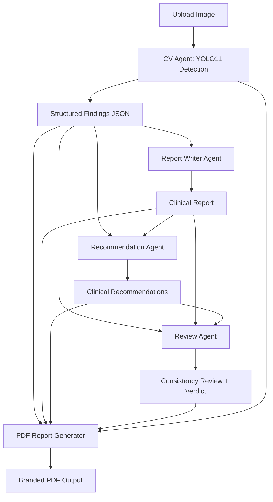

# capcell-ai

AI-Assisted Capsule Endoscopy Analysis and Multi-Agent Report Generation System.

Computer vision detects abnormalities in capsule endoscopy images, then a pipeline of LLM agents generates a structured clinical report, recommendations, and a consistency review — all delivered as a branded PDF.

---

## Architecture



## Features

- **YOLO11 Detection** — real-time abnormality detection on capsule endoscopy frames
- **Multi-Agent LLM Pipeline** — report writer, recommendation, and review agents via Groq API
- **Structured Findings** — detections converted to clinical-grade structured JSON
- **PDF Report Generation** — branded A4 PDF with findings, annotated image, and agent outputs
- **Gradio Web UI** — interactive interface for uploading images and viewing results
- **REST API** — FastAPI backend with upload, analysis, and health endpoints
- **CUDA Support** — automatic GPU acceleration when available

## Tech Stack

| Layer           | Technology                                     |
| --------------- | ---------------------------------------------- |
| Computer Vision | Python, YOLO11 (Ultralytics), PyTorch, OpenCV  |
| LLM Agents      | Groq API (openai/gpt-oss-20b), OpenAI SDK  |
| Web UI          | Gradio                                         |
| Backend API     | FastAPI, Uvicorn, Pydantic v2                  |
| PDF Reports     | xhtml2pdf, Markdown                            |
| Configuration   | python-dotenv, PyYAML                          |
| Environment     | uv                                             |

## Quick Start

### Prerequisites

- Python 3.11+
- [uv](https://docs.astral.sh/uv/getting-started/installation/) package manager

### Install uv

```bash
# Windows (PowerShell)
powershell -ExecutionPolicy ByPass -c "irm https://astral.sh/uv/install.ps1 | iex"

# macOS / Linux
curl -LsSf https://astral.sh/uv/install.sh | sh
```

### Clone and set up

```bash
git clone <repo-url> capcell-ai
cd capcell-ai

# Create virtual environment and install all dependencies
uv sync

# Copy environment config and add your Groq API key
cp .env.example .env
```

### Configure

Edit `.env` and set at minimum:

```
YOLO_MODEL_PATH=models/best.pt
GROQ_API_KEY=your_groq_api_key_here
```

Get a free Groq API key at [https://console.groq.com](https://console.groq.com).

### Run

**Gradio Web UI:**

```bash
uv run python webui.py
```

**FastAPI Server:**

```bash
uv run uvicorn backend.main:app --reload
```

The API docs are available at [http://127.0.0.1:8000/docs](http://127.0.0.1:8000/docs).

## Usage

### Web UI

1. Run `uv run python webui.py`
2. Open the Gradio interface in your browser
3. Upload a capsule endoscopy image
4. Click **Run Detection + Agents**
5. View annotated results, clinical report, recommendations, and PDF

### API Endpoints

| Method | Endpoint               | Description                           |
| ------ | ---------------------- | ------------------------------------- |
| GET    | `/api/health`        | Liveness probe with model/device info |
| POST   | `/api/upload/image`  | Upload and store an image             |
| POST   | `/api/analyze/image` | Run YOLO detection on an image        |

### Example: Analyze an Image

```bash
curl -X POST http://127.0.0.1:8000/api/analyze/image \
  -F "file=@path/to/endoscopy_image.jpg"
```

## Configuration

All settings are loaded from environment variables or a `.env` file.

| Variable                 | Default                      | Description                            |
| ------------------------ | ---------------------------- | -------------------------------------- |
| `APP_ENV`              | `development`              | Application environment                |
| `YOLO_MODEL_PATH`      | `models/capsule_yolo11.pt` | Path to YOLO model weights             |
| `CONFIDENCE_THRESHOLD` | `0.40`                     | Detection confidence threshold         |
| `DEVICE`               | auto (CUDA if available)     | Inference device (`cpu` / `cuda`)  |
| `MAX_UPLOAD_SIZE_MB`   | `500`                      | Max upload file size                   |
| `UPLOAD_DIR`           | `data/uploads`             | Upload storage directory               |
| `OUTPUT_DIR`           | `outputs`                  | Output storage directory               |
| `LOG_DIR`              | `logs`                     | Log file directory                     |
| `CORS_ORIGINS`         | `*`                        | Allowed CORS origins (comma-separated) |
| `GROQ_API_KEY`         | —                           | Groq API key (required for LLM agents) |
| `GROQ_MODEL`           | `openai/gpt-oss-20b`  | Groq model identifier                  |

See `.env.example` for the full list.

## Project Structure

```text
capcell-ai/
├── backend/
│   ├── api/            # FastAPI routes (upload, analysis)
│   ├── agents/         # LLM client and multi-agent pipeline
│   ├── cv/             # YOLO detector and postprocessing
│   ├── reporting/      # PDF report generation
│   ├── schemas/        # Pydantic models
│   ├── config.py       # Settings and logging
│   └── main.py         # FastAPI app entry point
├── config/
│   └── disease_classes.yaml
├── data/               # Dataset and uploads
├── models/             # YOLO model weights (.pt)
├── notebooks/          # Training notebooks
├── outputs/            # Generated reports and annotated images
├── scripts/            # Utility scripts
├── tests/              # Test suite
├── webui.py            # Gradio web UI entry point
├── pyproject.toml      # Project metadata and dependencies
└── .env.example        # Environment variable template
```

## Dataset

This project uses a capsule endoscopy dataset from Roboflow with 960 images across 8 classes:

- Normal (Z-Line, cecum, pylorus)
- Polyps
- Dyed lifted polyps
- Dyed resection margins
- Esophagitis
- Ulcerative colitis

## Model

The system uses YOLO11 for detection. Place your trained model weights in the `models/` directory and set `YOLO_MODEL_PATH` in `.env`.

To download a demo COCO-pretrained model for testing:

```bash
uv run python scripts/download_demo_model.py
```

## License

MIT

## Credits

**Tharun Bala B**
**Manikandan M**
Er. Perumal Manimekalai College of Engineering
Department of Artificial Intelligence & Data Science
Academic Year 2026–27
